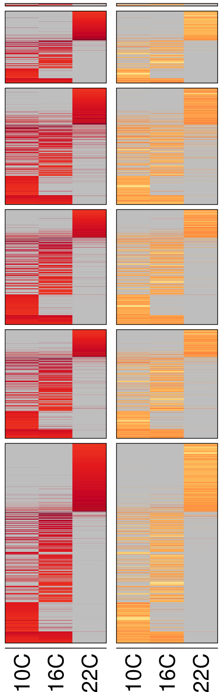

```{=html}
<style>
.mybreak {
   break-before: column;
}
</style>
```
```{=html}
<style>
.ref-align {
  text-align: left
}
</style>
```
```{=html}
<style>
img {
  display: block;
  margin-top: -7px; /* Adjust this value as needed */
}

.my-image {
  margin-top: -1px; /* Adjusted value for a specific image */
}
</style>
```
```{=html}
<style type="text/css">
    .brsmall {
        display: block;
        margin-bottom: .3em;
    }
    .brxsmall {
        display: block;
        margin-bottom: .4em;
    }
    .brsmallneg {
        display: block;
        margin-bottom: -.4em;
    }
    .brconclusion {
        display: block;
        margin-bottom: .8em;
    }
</style>
```
```{css, echo=FALSE}
div.logo_left{
  width: 20%;
}
div.poster_title{
  width: 70%;
}
```

```{r, include=FALSE}
knitr::opts_chunk$set(echo = FALSE,
                      warning = FALSE,
                      tidy = FALSE,
                      message = FALSE,
                      fig.align = 'center',
                      strip.white = T,
                      out.width = "100%",
                      fig.show='asis')
options(knitr.table.format = "html") 
library("knitr")
library("readxl")
library("kableExtra")
library(stringr)
# library(EML)
```

```{r, include=FALSE}
knitr::write_bib(c('posterdown', 'rmarkdown','pagedown'), 'packages.bib')
```

```{r, include=FALSE}
library(stringr)
fix_wrap_kable <- function(kbl) {

  kbl <- kbl %>% 
    str_remove(paste0("\\\\caption[{].+[}]\\n")) %>% # Removes the first caption
    str_replace("\\\\end[{]tabular[}]",
                paste0("\\\\end{tabular}\n\\\\caption{",attributes(kbl)$kable_meta$caption %>% # Adds the new caption using the string supplied in the kable 'caption' argument.
                # The '{0,100}' is just a hack around lookbehind needing a set length, so the function will not work if the table label is longer 
                         str_replace("(?<=[(]\\\\#.{0,100})[)]","}") %>% # Fixes and issue with pandoc syntax being mixed with LaTeX 
                         str_replace("\\label[{]|[(]\\\\#","\\\\\\\\label{"),"}\n")) %>% # Adds an appropriate amount of backslashes before "\label"
    set_attributes(attributes(kbl)) # Ensures that the returned object is still a kable
  
  attributes(kbl)$kable_meta$caption <- NA # Removes the caption from the metadata
  
  return(kbl)
}
```

# Introduction

DNA cytosine methylation is the addition of a methyl group to a cytosine
in the DNA. It impacts transcription and therefore plays a major role in
several vital processes. In mammals, DNA cytosine methylation
predominantly occurs in CG sequence contexts. In plants, in addition to
the CG context, the CHG and CHH contexts are common as well.

<figure>

<center>


<br>

<figcaption><b>Figure 1:</b> Methylation contexts in mammals and
plants.</figcaption>

</center>

</figure>

</b>

```{r methylationcontexts, include=F, fig.cap="Methylation contexts in mammals and plants.", out.width="80%"}
# knitr::opts_chunk$set(echo = FALSE,
#                       warning = FALSE,
#                       tidy = FALSE,
#                       message = FALSE,
#                       fig.align = 'center',
#                       out.width = "60%")
knitr::include_graphics("figures/methylation_contexts.png")
```


Genomic regions, which control gene expression and protein production, are 
influenced by DNA methylation. Methylation can modify how these regions function, 
often silencing gene expression or regulating gene activity, thus playing a 
important role in development and genome stability.

<figure>

<center>


<br>

<figcaption><b>Figure 2:</b> Schematic representation of the transcriptional and translational regions of a gene, including the upstream and downstream regions. The figure highlights the intergenic regions, untranslated regions (UTR), exons, and introns.</figcaption>

</center>

</figure>

</b>

```{r genomic_regions, include=F, fig.cap="Methylation contexts in mammals and plants.", out.width="80%"}
# knitr::opts_chunk$set(echo = FALSE,
#                       warning = FALSE,
#                       tidy = FALSE,
#                       message = FALSE,
#                       fig.align = 'center',
#                       out.width = "60%")

```


# Methods 


Jensen-Shannon Divergence (JSD) measures the similarity between probability 
distributions, providing a symmetric comparison of datasets. 
In DNA methylation analysis, JSD can be used to compare methylation patterns 
across samples, identifying regions with significant epigenetic differences.


<figure>

<center>


<br>

<figcaption><b>Figure 3:</b> Jensen-Shannon Divergence (JSD) formula and entropy calculation.</figcaption>

</center>

</figure>

</b>

```{r jsd, include=F, fig.cap="Methylation contexts in mammals and plants.", out.width="80%"}
# knitr::opts_chunk$set(echo = FALSE,
#                       warning = FALSE,
#                       tidy = FALSE,
#                       message = FALSE,
#                       fig.align = 'center',
#                       out.width = "60%")

```


The goal of smoothing in DNA methylation analysis is to lower mistakes in 
divergence computations so that methylation patterns can be compared more 
accurately. This method contributes to sample consistency, which yields more 
reliable results for analysis such as JSD.


<figure>

<center>


<br>

<figcaption><b>Figure 4:</b> Comparison of various smoothing methods across entropy, JSD, and Kolmogorov-Smirnov metrics.</figcaption>


</center>

</figure>

</b>

```{r smooth, include=F, fig.cap="Methylation contexts in mammals and plants.", out.width="80%"}
# knitr::opts_chunk$set(echo = FALSE,
#                       warning = FALSE,
#                       tidy = FALSE,
#                       message = FALSE,
#                       fig.align = 'center',
#                       out.width = "60%")

```


# Datasets

The datasets used in this study are from the [ 1001 Arabidopsis Epigenomes Project]
(http://signal.salk.edu/1001.php)


<div style="position: relative; width: 100%;">
  
  
</div>

<figcaption><b>Figure 5:</b> Dataset distribution (top-left) and sample count per country for the 1001 Arabidopsis Epigenomes Project.</figcaption>


```{r dataset_distribution, include=F, fig.cap="Dataset distribution (top-left) and sample count per country.", out.width="80%"}


```


# Pipeline

This pipeline supports DNA methylation analysis by utilizing divergence calculations 
and generating outputs that can be used for additional statistical testing or visualization
for further analysis.

<figure>

<center>


<br>

<figcaption><b>Figure 6:</b> Overview of the DNA methylation analysis pipeline</figcaption>

</center>

</figure>

```{r pipeline, include=F, fig.cap="Overview of the DNA methylation analysis pipeline", out.width="100%"}

```


# Results


We analyzed the impact of different temperature conditions (10°C, 16°C, 22°C) on 
DNA methylation in the CHG, CHH, and CpG contexts across various genomic regions.
By calculating the JSD and methylation levels, we revealed distinct patterns of 
methylation context-specific changes across these temperature conditions.


<figure>

<center>


<br>

<figcaption><b>Figure 7:</b> Jensen-Shannon Divergence (JSD) as a function of
methylation levels in CHG, CHH, and CpG contexts under three temperature conditions.</figcaption>


</center>

</figure>

```{r temp, include=F, fig.cap="Overview of the DNA methylation analysis pipeline", out.width="100%"}

```


We further explored how methylation levels and JSD vary across different genomic
regions, such as exonic, intergenic, and transposable elements, under three temperature conditions 
(10°C, 16°C, 22°C). This analysis aimed to identify regions that are particularly sensitive to 
temperature-induced epigenetic changes. The results could provide a clearer image 
of how genomic context influences methylation patterns and gene regulation in response to environmental stress.


<figure>
  <center>
    
    
    
    
    
    <br>
    <figcaption><b>Figure 8:</b> Heatmap comparison of methylation levels (Meth) and 
    JSD across various genomic regions (exonic, intergenic, intronic, etc.) and temperatures
    (10°C, 16°C, 22°C) in CHG, CHH, and CpG contexts.</figcaption>

  </center>
</figure>


```{r results, include=F, fig.cap="Comparison of methylation contexts in CHG, CHH, and CpG regions.", out.width="100%"}


```


<figure>

<center>


<br>

<figcaption><b>Figure 9:</b> Methylation and JSD patterns in CpG sites across intergenic regions under three temperature conditions. The color gradient indicates the level of methylation and JSD, with red representing higher values and blue representing lower values.</figcaption>


</center>

</figure>


# Additional Findings


Different gene expression profiles among samples at different temperatures (10°C, 16°C, and 22°C) are displayed in this transcriptome heatmap. The clustering shows that there are discernible variations in the effects of temperature on gene expression. The precise genes at play and their possible functions in temperature adaptation and stress responses in plants require more research.


<figure>
  
  <figcaption><b>Figure 10:</b> Transcriptomic heatmap showing gene expression profiles under different temperature conditions (10°C, 16°C, 22°C)</figcaption>

</figure>


# Conclusion

This poster represents the results of our analysis on how temperature influences DNA methylation 
and gene expression in Arabidopsis thaliana. Using our data analysis pipeline, we examined methylation levels 
and Jensen-Shannon Divergence under different temperature conditions (10°C, 16°C, 22°C) to investigate how 
environmental factors might affect epigenetic regulation. Through this analysis, we aimed to identify 
temperature-dependent patterns of methylation and gene expression changes, with further investigation needed 
to explore the long-term impacts on plant adaptation and stress responses.


